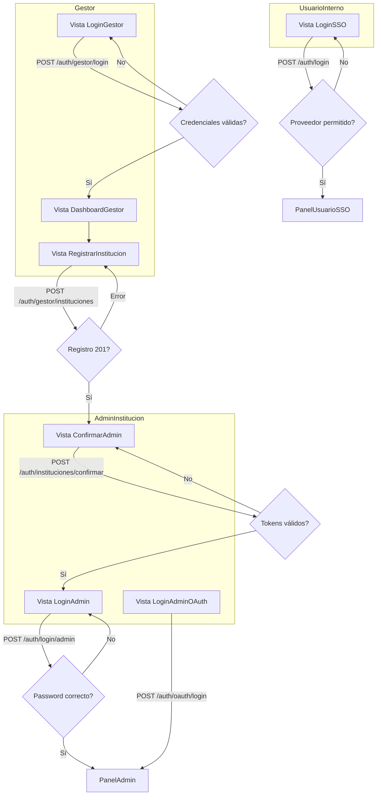

# Flujo Front – Autenticación y Onboarding

## Diagrama general

## Vistas requeridas

1. **LoginGestor** – formulario email/contraseña, manejo de errores 401/403.
2. **DashboardGestor** – acceso a acciones internas tras autenticarse.
3. **RegistrarInstitucion** – formulario para datos institucionales + admin inicial; debe mostrar resultado y avisar al gestor.
4. **ConfirmarAdmin** – formulario para `institucion_id`, tokens y correo del admin.
5. **LoginAdmin** – credenciales tradicionales (`POST /auth/login/admin`).
6. **LoginAdminOAuth** – inicia flujo OAuth y completa en `POST /auth/oauth/login`.
7. **LoginSSO** – formulario para usuarios internos (dominio/proveedor autorizado) que consume `POST /auth/login`.

## Endpoints involucrados

- `POST /auth/gestor/login` – ingreso de gestores.
- `POST /auth/gestor/instituciones` – creación de instituciones/admins.
- `POST /auth/instituciones/confirmar` – etapa de tokens.
- `POST /auth/login/admin` y `POST /auth/oauth/login` – accesos de admin institucional.
- `POST /auth/login` – SSO de usuarios internos.
- `GET /auth/me` – verificación de sesión desde paneles.

## Consideraciones de UX

- Mostrar mensajes claros cuando un gestor intente registrar una institución con email duplicado.
- Tras confirmar la institución, redirigir al admin a `LoginAdmin` y comunicar que los tokens ya se consumieron.
- Para OAuth/SSO, guiar sobre dominios permitidos y estados de error (proveedor no soportado, cuenta no vinculada, etc.).
