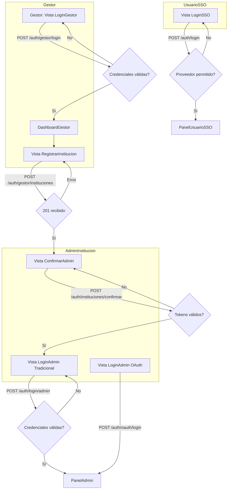

# Flujos de Login y Registro

## Diagrama de procesos

## Vistas necesarias

1. **LoginGestor**: formulario email/contraseña con manejo de errores 401/403.
2. **DashboardGestor**: acceso a la acción de registrar instituciones.
3. **RegistrarInstitucion**: formulario para datos de institución y admin inicial; debe mostrar resultado (IDs) tras guardar.
4. **ConfirmarAdmin**: formulario donde el admin ingresa `institucion_id`, tokens y email.
5. **LoginAdmin Tradicional**: email/contraseña para `/auth/login/admin`.
6. **LoginAdmin OAuth**: inicia el flujo OAuth y finaliza en `/auth/oauth/login`.
7. **LoginSSO**: selector de proveedor/domino y email para `/auth/login` orientado a usuarios internos.

Cada vista debe almacenar o limpiar los tokens según el flujo y redirigir a la pantalla adecuada (`PanelGestor`, `PanelAdmin`, `PanelUsuarioSSO`).
